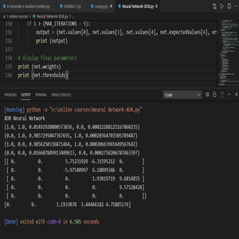

  

I used Anaconda for this which includes the numpy library.

An instance of each class is created and the main loop of the program steps through:
1. set the next input and expected output
2. evaluate the hidden and output layers of the network based on input
3. calculate current error and update thresholds and weights

You can learn more at the [My GitHub Repository](https://github.com/attaullahshafiq10/XOR-Learning-Neural-Network).
