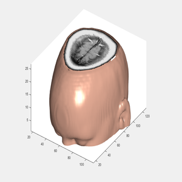

The example shows how to explore a volume of data by extracting slices through a three-dimensional MRI data set using imtransform and tformarray functions.

Source: <a href="https://github.com/attaullahshafiq10/Display-MRI-Data"><i class="large github icon"></i>Display-MRI-Data</a>
